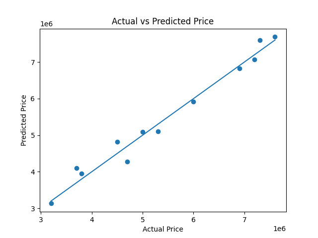
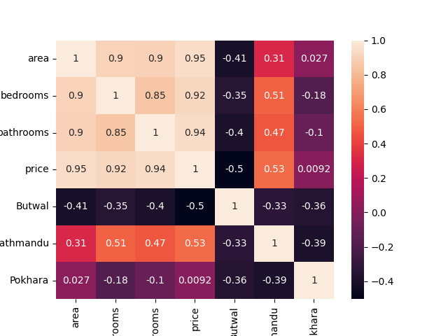

# House Price Prediction using Machine Learning

## Overview

This project predicts house prices using machine learning regression algorithms.

## Dataset Features

* Area
* Bedrooms
* Bathrooms
* City

Target Variable:

* Price

## Data Preprocessing

* Handled missing values using median imputation
* One-Hot Encoding for city column
* Train-Test Split

## Models Used

1. Linear Regression
2. Decision Tree Regressor
3. Random Forest Regressor

## Results

| Model                   | R² Score |
| ----------------------- | -------- |
| Linear Regression       | 0.985    |
| Random Forest Regressor | 0.938    |
| Decision Tree Regressor | 0.775    |

## Conclusion

Linear Regression achieved the best performance on this dataset with an R² score of 0.985 and the lowest prediction error.

## Visualization

### Actual vs Predicted House Prices

### Feature Importance

### Heat Map

## Technologies Used

* Python
* Pandas
* NumPy
* Matplotlib
* Scikit-Learn
